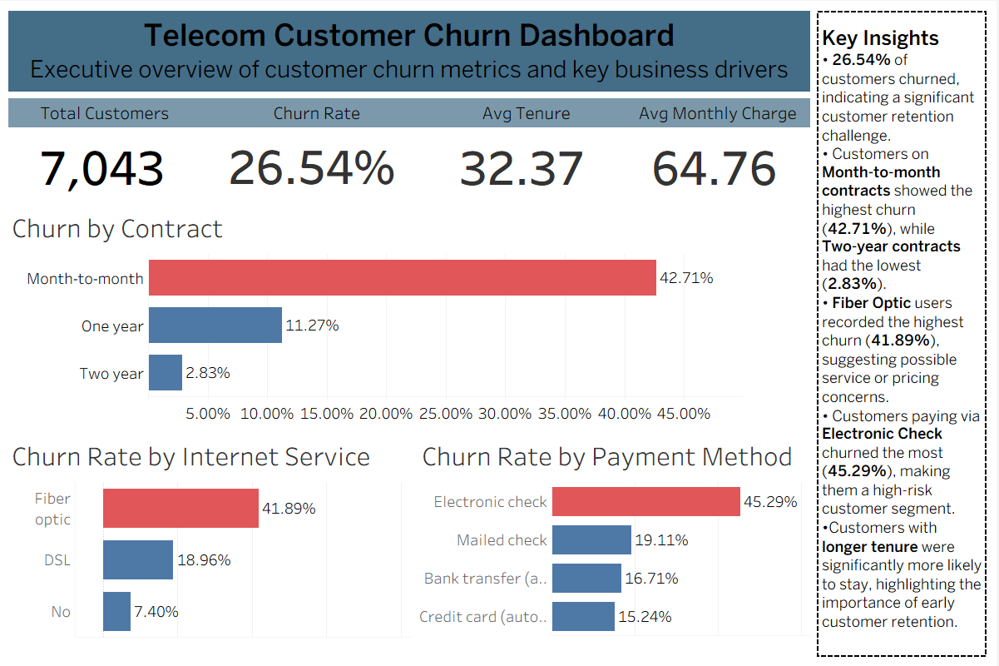

# Telecom Customer Churn Analysis

End-to-end churn analysis on the IBM Telco Customer Churn dataset (7,043 customers) — from cloud SQL exploration through statistical testing, predictive modeling, and an executive dashboard.

**Skills demonstrated:** SQL (CTEs, window functions, aggregate functions), cloud data warehousing (BigQuery), exploratory data analysis, statistical hypothesis testing (t-test, chi-square), classification modeling (Logistic Regression, Random Forest), model evaluation (accuracy, precision, recall, F1-score), data visualization and dashboard design (Tableau), business insight communication.

## Business Problem

Telecom companies lose customers every month, and every lost customer is lost recurring revenue. This project asks: **which customers are likely to churn, why, and what should the business do about it?**

## Tools Used

- **Google BigQuery** — data cleaning, exploratory SQL, window functions, CTEs
- **Python** (Pandas, NumPy, Matplotlib, SciPy, Scikit-learn) — data manipulation, visualization, statistical hypothesis testing, and classification modeling
- **Tableau** — interactive executive dashboard, connected live to BigQuery

## Project Structure
├── sql/
│ └── bigquery_telco_customer_churn.sql # BigQuery exploration, cleaning, and analysis
├── notebook/
│ └── Telco_customer_churn.ipynb # Statistical testing + ML models
├── tableau/
│ └── Telco_Customer_Churn_Dashboard.twb # Interactive dashboard (connected to BigQuery)
├── screenshots/
│ └── Telco_Dashboard_overview.png
└── README.md

*Note: the raw dataset isn't included in this repo. It's the standard IBM Telco Customer Churn dataset, available on [Kaggle](https://www.kaggle.com/datasets/blastchar/telco-customer-churn).*

## Key Findings

- **Contract type is the strongest churn driver.** Month-to-month customers churn at **42.71%**, compared to just **2.83%** for two-year contract customers (chi-square test, p < 0.001).
- **Fiber optic internet customers churn more** (41.89%) than DSL (18.96%) or no-internet customers (7.40%) (chi-square test, p < 0.001).
- **Electronic check payers are the highest-risk segment** by payment method, churning at **45.29%** — the highest of any payment type.
- **Tenure and monthly charges both differ significantly** between churned and retained customers (t-tests, p < 0.001): churned customers have shorter tenure and higher monthly charges on average.
- **Logistic Regression (81.3% accuracy, 0.55 recall on churners) outperformed Random Forest (79.6% accuracy, 0.47 recall)** on the metric that matters most for this problem — correctly identifying at-risk customers, not just overall accuracy. Since churners make up only ~26% of the dataset, accuracy alone is a misleading metric; recall better reflects how many at-risk customers the model actually catches.
- **Top predictive features:** TotalCharges, tenure, and MonthlyCharges — though these overlap significantly with each other (TotalCharges ≈ tenure × MonthlyCharges), so Contract type and TechSupport access are more independent, actionable signals.

## Business Recommendation

Prioritize retention outreach toward **month-to-month, fiber optic, short-tenure customers paying by electronic check with high monthly charges** — this segment shows the clearest statistical and predictive signal for churn risk. Encouraging longer contract terms and shifting customers off electronic check toward autopay methods are two concrete, low-cost interventions supported directly by this analysis.

## Dashboard Preview

## Dataset Source

IBM Telco Customer Churn dataset, hosted on [Kaggle](https://www.kaggle.com/datasets/blastchar/telco-customer-churn) (uploaded by BlastChar). Originally published by IBM as a sample dataset for customer analytics.
